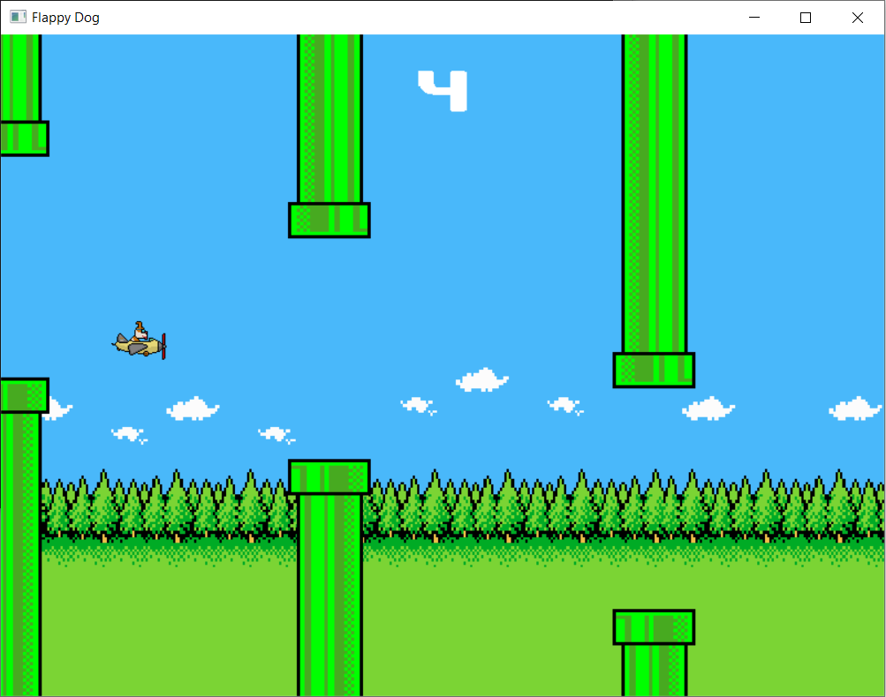

# Flappy Dog

Flappy Dog is a Flappy Bird-style game developed in C++ with SDL2.

## Instructions

- Press the space bar to jump.
- Press the 'R' key to restart the game when you die.

## Installation

### Windows

- Clone the repository **"git clone --recursive https://github.com/FrancoBarrera99/FlappyDog.git"**
- Change directory to the CMakeLists.txt path **"cd .\FlappyDog\FlappyDog"**
- Create a build directory **"mkdir build"**
- Change directory to build **"cd .\build"**
- Run CMake configuration **"cmake .."**
- Open Visual Studio .sln
- Build your desire configuration
- Change directory to output files path **"cd .\bin\yourConfiguration"**. For example, if you use **Debug**, replace yourConfiguration so the path would be **".\build\bin\Debug"**
- Run FlappyDog.exe **".\FlappyDog.exe"**

### Linux

- Clone the repository **"git clone --recursive https://github.com/FrancoBarrera99/FlappyDog.git"**
- Change directory to the CMakeLists.txt path **"cd ./FlappyDog/FlappyDog"**
- Create a build directory **"mkdir build"**
- Change directory to build **"cd ./build"**
- Run CMake configuration **"cmake .."**
- Build the project **"make"**
- Change directory to output files path **"cd ./bin/yourConfiguration"**. For example, if you use **Debug**, replace yourConfiguration so the path would be **"./build/bin/Debug"**
- Run FlappyDog.exe **"./FlappyDog.exe"**

## Acknowledgments

This project makes use of the following third-party libraries and resources. I would like to express my gratitude to their authors and contributors:

- [SDL (Simple DirectMedia Layer)](https://www.libsdl.org/): A powerful and cross-platform multimedia library for graphics, audio, and input handling.
- [SDL2_image](https://www.libsdl.org/projects/SDL_image/): An image loading library for SDL, which allows us to work with various image formats.
- [SDL2_ttf](https://www.libsdl.org/projects/SDL_ttf/): A library for rendering TrueType fonts in SDL applications.
- [SDL_mixer](https://www.libsdl.org/projects/SDL_mixer/): A library for handling audio mixing and sound effects in SDL applications.

I greatly appreciate the hard work and dedication of the developers behind these libraries, as they have been instrumental in the creation of this project.
